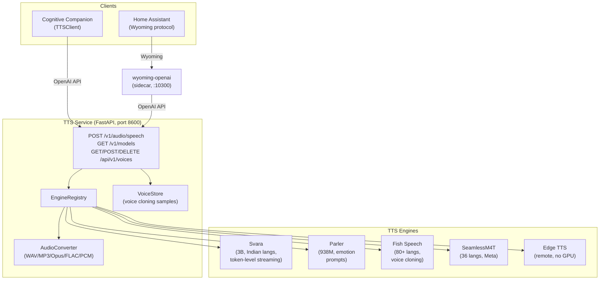

# TTS Service

Self-hosted text-to-speech microservice for the Cognitive Companion platform. Exposes an OpenAI-compatible API with GPU-accelerated Indian language TTS and voice cloning.

Documentation: [silvermind-project.github.io](https://silvermind-project.github.io/features/tts-service). Agent reference: [AGENTS.md](AGENTS.md). Agent quick-start: [CLAUDE.md](CLAUDE.md).

---

## Architecture



Five engines implement the same `TTSEngine` ABC. Engines are loaded at startup based on config. The `model` field in the API request selects which engine to use.

---

## Engines

| Engine | Model | Languages | Streaming | Voice Cloning | VRAM | License |
| --- | --- | --- | --- | --- | --- | --- |
| **svara** (default) | kenpath/svara-tts-v1 | 22 Indian langs | Token-level | No | ~8 GB | Apache-2.0 |
| **parler** | ai4bharat/indic-parler-tts | 11 Indian langs | Chunked | No | ~4 GB | Apache-2.0 |
| **fish_speech** | fishaudio/s2-pro | 80+ languages | Chunked | Yes | ~8-12 GB | Research |
| **seamless** | facebook/seamless-m4t-v2-large | 36 languages | No | No | ~6-8 GB | CC-BY-NC-4.0 |
| **edge_tts** | travisvn/openai-edge-tts | 40+ languages | Proxied | No | None | MIT |

Svara is the recommended engine for Indian English and Tamil. Edge TTS is best when no GPU is available.

---

## Prerequisites

| Component | Purpose |
| --- | --- |
| Python 3.11+ | Runtime |
| NVIDIA GPU (4-12 GB VRAM) | Svara, Parler, Fish Speech, Seamless engines |
| ffmpeg | MP3 and Opus encoding (installed in Docker image) |
| HuggingFace models | Downloaded on first run to `data/hf_cache` |
| Docker + NVIDIA Container Toolkit | Container runtime |
| openai-edge-tts (remote service) | Only for edge_tts engine |

---

## Quick start

### Docker Compose

```bash
cp .env.example .env
docker compose up -d
```

First start downloads models (~6 GB for Svara + SNAC). Subsequent starts use cached models.

### Local development

```bash
pip install -e ".[svara,dev]"
uvicorn app.main:app --host 0.0.0.0 --port 8600 --reload
```

### Tests

```bash
pip install -e ".[dev]"
pytest tests/ -v
```

---

## API

### `POST /v1/audio/speech` — Generate speech (OpenAI-compatible)

```bash
curl -X POST http://localhost:8600/v1/audio/speech \
  -H "Content-Type: application/json" \
  -d '{"model": "svara", "input": "Hello world", "voice": "speaker_0", "response_format": "mp3"}' \
  --output speech.mp3
```

Streaming: set `"stream": true` to receive raw PCM int16 chunks.

### `GET /v1/models` — List loaded engines
### `GET /api/v1/voices` — List all voices (built-in + custom samples)
### `POST /api/v1/voices/upload` — Upload voice reference sample for cloning
### `DELETE /api/v1/voices/{voice_id}` — Delete a voice sample
### `GET /health` — GPU status, loaded engines, voice sample count

---

## Configuration

All configuration is in `config/settings.yaml` with `${ENV_VAR}` interpolation.

```yaml
engines:
  enabled: [svara]           # Engines to load at startup
  default: svara             # Default engine
  svara:
    device: "cuda"           # cuda, cuda:0, cpu
    dtype: "bfloat16"        # bfloat16, float16, float32
    max_tokens: 4096

server:
  host: "0.0.0.0"
  port: 8600
```

See [silvermind-project.github.io](https://silvermind-project.github.io/features/tts-service) for full configuration reference and engine selection guide.

---

## Home Assistant integration

A Wyoming protocol bridge is available via the `wyoming-openai` sidecar:

```bash
docker compose --profile wyoming up -d
```

Add the Wyoming integration in Home Assistant: host IP, port 10300.

---

## Integration with Cognitive Companion

```yaml
# In cognitive-companion config/settings.yaml
tts:
  url: "${TTS_API_URL}"       # http://tts-service:8600
  default_voice: "speaker_0"
  default_speed: 0.85
```

---

## License

AGPL-3.0-or-later. Individual engines carry their own licenses: Svara and Parler are Apache-2.0, Fish Speech requires a license for commercial use, SeamlessM4T is CC-BY-NC-4.0, Edge TTS is MIT.
